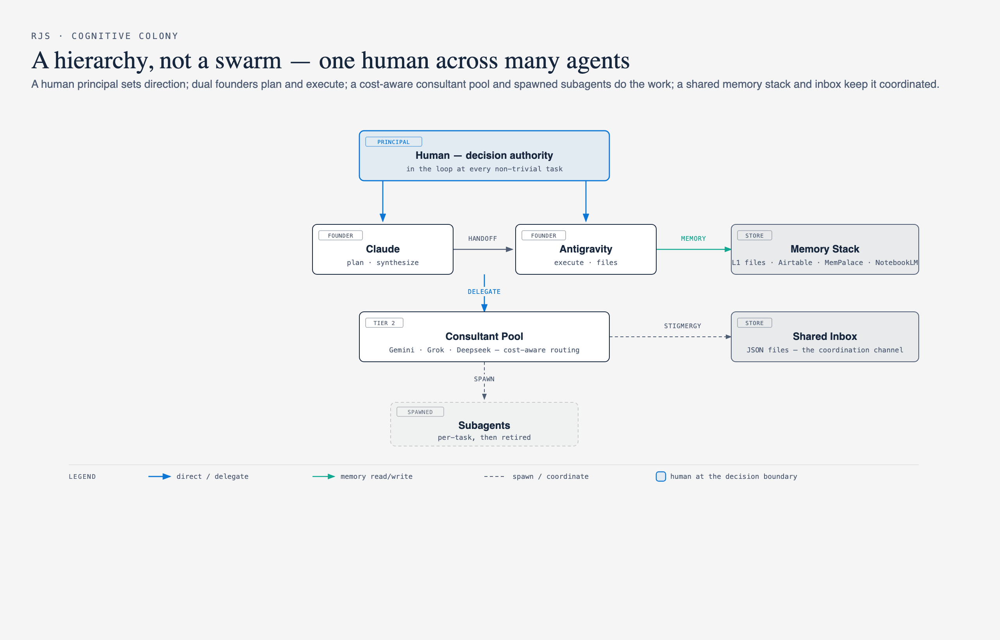

# RJS Cognitive Colony

A personal multi-agent operating system — a hierarchical "colony" of AI agents that extends one person's thinking across many specialized models, each with its own memory, tools, and cost profile. Claude plans and synthesizes; other models scout, analyze, and execute; a human stays at the decision boundary.

> **Status: Production (v0.98) — in active daily use.** The founders, consultant agents, memory stack, cost-aware routing, and dynamic orchestration loop are all running in real workloads. Remaining work is hardening and edge cases toward v1.0. This is a personal system in production use, not a commercial product.



## Who it's for

A single power user (the "Principal") who already relies on several AI tools and standalone projects, and wants them to act as one coordinated team instead of separate chats.

**From → To:** one chat window with one model and no memory → a coordinated colony where the right model is picked per task, cost is controlled, and context persists across sessions.

## 1. Pain Points

Problems with how AI actually gets used day-to-day:

- **One model, one context, no memory** — a single chat forgets everything between sessions and forces one model to be researcher, planner, coder, and critic all at once.
- **Naive multi-agent makes it worse** — wiring agents peer-to-peer (a "swarm") amplifies errors: unstructured multi-agent networks compound mistakes up to ~17.2× (Google DeepMind), and coordination gains plateau around ~4 agents.
- **Cost balloons** — sending every step to a top-tier model burns budget on work a cheaper/free model could do.
- **Standalone tools don't talk** — personal projects (a memory engine, a boardroom debate tool, a research RAG) each work alone with no shared channel or registry.

## 2. Gap

| What already existed | What was missing |
|----------------------|------------------|
| Several capable models (Claude, Gemini, Grok, Deepseek, …) | No router picking the right one per task by skill + cost |
| Standalone personal projects (memory, boardroom, research) | No registry or shared channel to coordinate them |
| Long chats | No persistent memory stack across sessions |
| Autonomy hype | No deliberate human-in-the-loop at the decision boundary |

## 3. Concept

Model the system as a **colony**, not a swarm — hierarchy for error-containment, specialization for depth, a shared environment for coordination:

1. **Hierarchy over swarm** — a supervisor-worker structure (centralized) contains error ~4.4× vs ~17.2× for unstructured networks
2. **Dual founders** — Claude (planner / synthesizer) and Antigravity (file / workspace executor) specialize and don't overlap
3. **Memory as a first-class citizen** — a layered hot/warm/cold stack (L1→L2→L4→L5) so context survives across sessions
4. **Cost-aware routing** — try a free/cheap pool (Gemini) first, escalate to a premium pool (Claude) only for synthesis and hard decisions
5. **Human at the decision boundary** — not full autonomy; a working-model assessment precedes any non-trivial task

The "colony" metaphor is deliberate: hierarchy (founders), specialized castes (consultants), and *stigmergy* — agents coordinate by leaving messages in a shared folder, like a digital pheromone trail.

## 4. Architecture

Three tiers of agents over a layered memory stack, with cost-aware routing between model pools.

```
              Principal (human) — decision authority
                          │
        ┌─────────────────┴─────────────────┐
   Tier 1: Founders   Claude (planner/COO) · Antigravity (executor/architect)
        │
   Tier 2: Consultants   Grok (real-time scout / devil's advocate)
        │                 Gemini (deep analyst / L4 historian)
        │                 Deepseek · OpenRouter (via worker scripts)
        │
   Tier 3: Subagents   spawned per task into /agents, then retired
```

**Memory stack**

| Layer | Store | Role |
|-------|-------|------|
| L1 | `AGENTS.md` / `CLAUDE.md` | identity + rules (always in context) |
| L2a | Airtable | strategic insights |
| L2b | Obsidian | long-form notes |
| L4 | MemPalace → Supabase pgvector | cross-session personal RAG (`mempalace search`) |
| L5 | NotebookLM (`notebooklm ask`) | external research corpus (no PII) |

**Coordination (stigmergy)** — agents communicate by dropping JSON files in `shared/inbox`; results and logs land in `shared/results` and `shared/logs`. A registry (`registry/COLONY_MANIFEST.json`) records each agent, its tier, and whether it's a local component or an external standalone project.

## 5. Design principles in the repo

- **Dynamic, not static workflow** — the orchestrator reads the task intent + available agents from the manifest at runtime and picks the team, and can pivot mid-task if new information appears (no fixed 1-2-3-4 pipeline)
- **Every model behind one interface** — each provider has a worker script (`scripts/*_worker.py`) so the orchestrator calls them uniformly
- **Cost is tracked, not assumed** — `scripts/cost_ledger.py` + `agent_pricing.json` record per-call cost so routing decisions are measurable
- **External tools are services, not forks** — standalone projects are registered and called, never copied in

## 6. Repository layout

```
registry/COLONY_MANIFEST.json   agent registry (tier, path, status)
agents/                         per-provider agents (Antigravity, Gemini, Grok, Deepseek, OpenRouter, ChatGPT)
scripts/                        worker scripts per model + cost ledger + pricing
  ├─ antigravity_worker.py      workspace/file executor bridge
  ├─ {grok,deepseek,openrouter}_worker.py   provider bridges
  ├─ cost_ledger.py             per-call cost accounting
  └─ agent_pricing.json         model price table
shared/                         inbox / results / logs — the coordination channel
HighLevelConcept.md             PHLD: full architecture, principles, open questions
The Cognitive Colony - Dynamic Workflow Design.md   dynamic-orchestration design
AGENTS.md / CLAUDE.md           founder identity + rules (L1 memory)
```

## 7. Implementation (status — v0.98, in production)

| Item | Status |
|------|--------|
| Foundation + workspace structure | ✅ In production |
| Registry with external projects (memory / boardroom / research) | ✅ In production |
| Agent roster + `antigravity_worker.py` bridge | ✅ In production |
| Provider worker scripts (Grok / Deepseek / OpenRouter) | ✅ In production |
| Cost ledger + pricing table | ✅ In production |
| Memory stack L1–L5 wiring | ✅ In production |
| Full dynamic orchestration loop (intent → team → pivot → synthesis) | ✅ In production |
| Hardening + edge cases toward v1.0 | 🚧 Remaining |

> Concept and design docs (`HighLevelConcept.md`, the workflow design) capture the full architecture; the code here is the running system that implements it.
